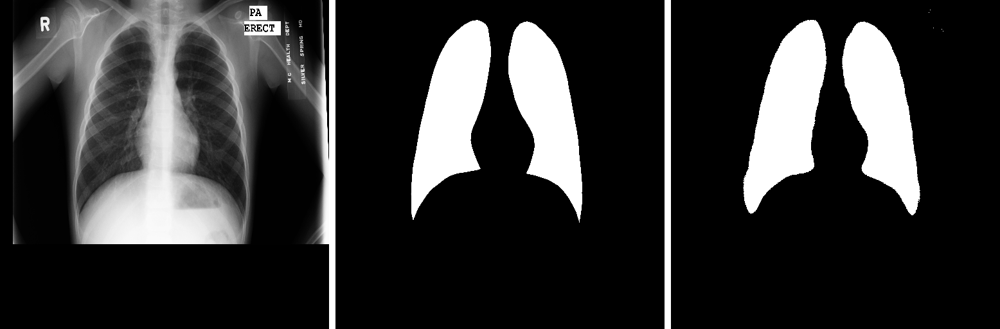
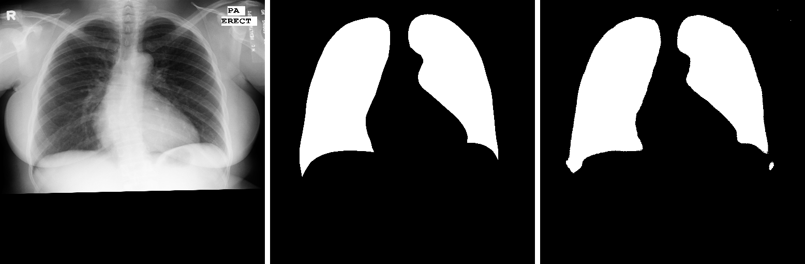
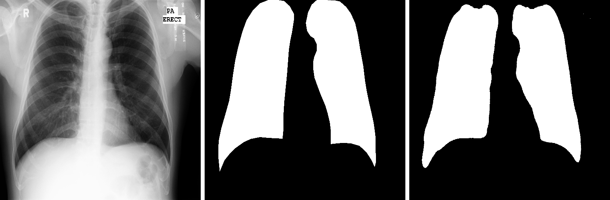

# UNET
This repository contains the code for the lung segmentation on the Montgomery dataset using UNET architecture in TensorFlow 2.0 framework.

# Overview
- Architecture
- Results

# Architecture
The block diagram of the UNET architecture taken from the original paper.

|  |
| :--: |
| *U-Net Architecture* |

# Results
The images below contains:
1. Input image
2. Ground truth 
3. Predicted mask

|  |
| :--: |
|  |
|  |
|  |
